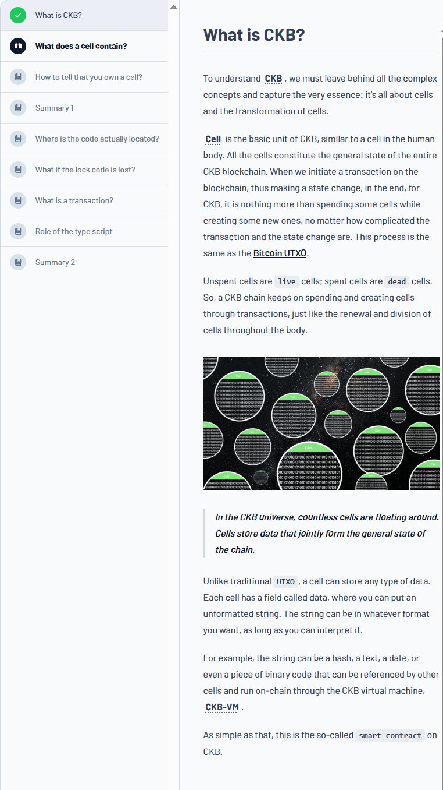
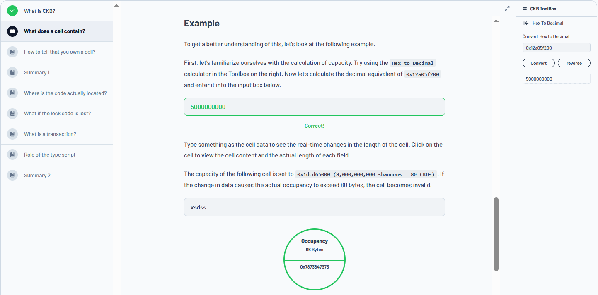
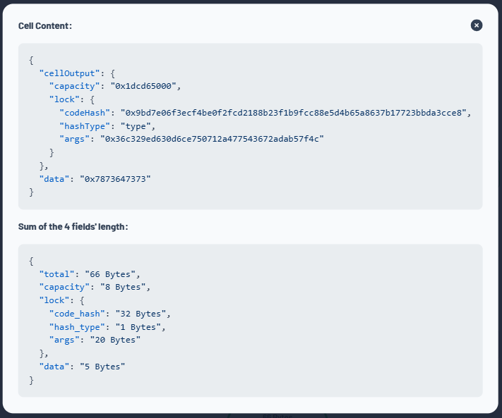
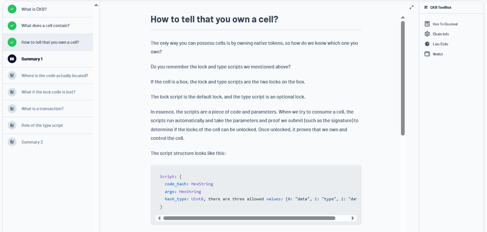
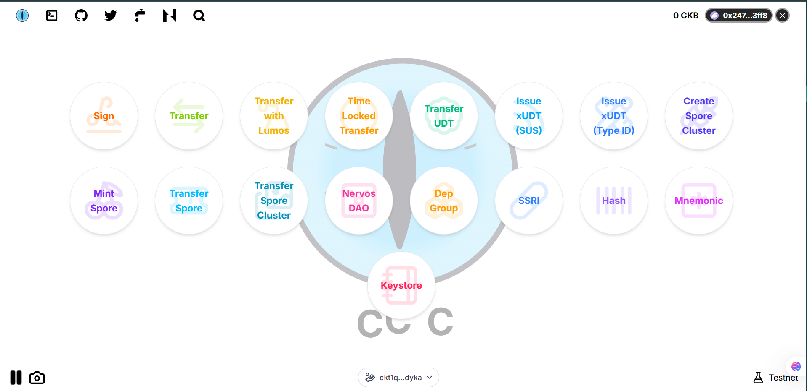
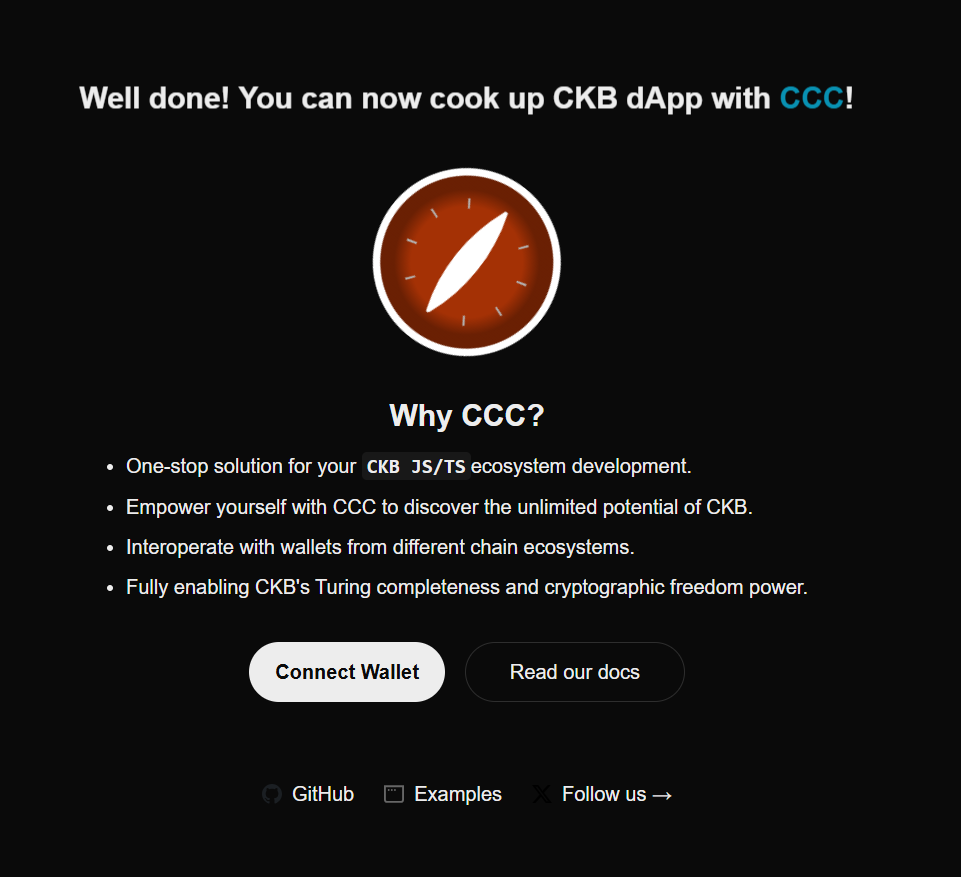
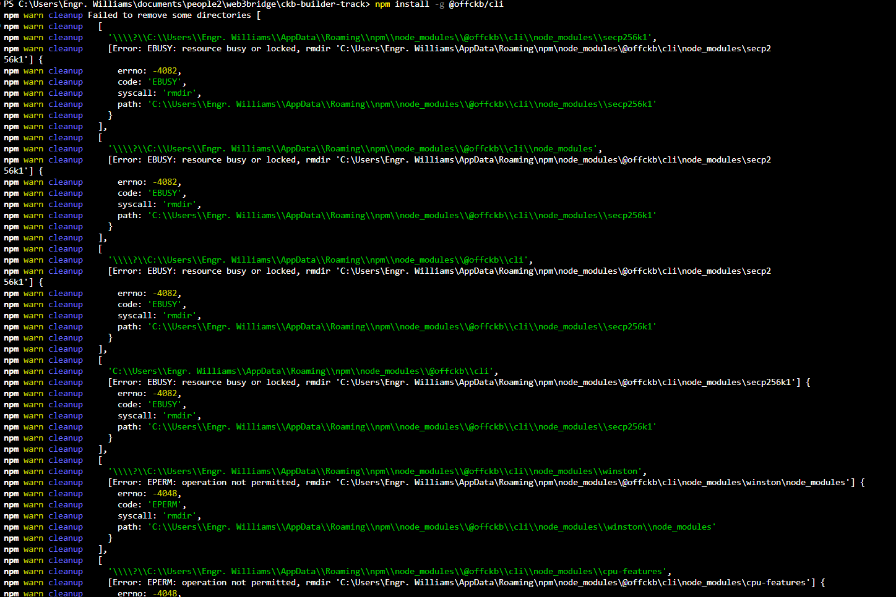
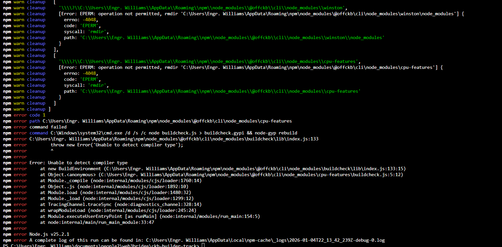

# Builder Track Weekly Report — Week 1

**Name:** Williams Akinwamide
**Week Ending:** 01-04-2026

## Courses Completed

*   **CKB Theoretical Knowledge:**
    *   Began the first module of the CKB Academy, covering the fundamentals of CKB. Progress is documented in the images section below.
*   **Building on CKB with JavaScript/TypeScript:**
    *   Learned about building applications on CKB using **CCC (Common Chain Connector)**, an all-in-one tool for dApp development.
    *   Explored the **CCC App** to understand basic CKB scenarios.
    *   Utilized the **CCC Playground** for in-browser code testing and data visualization.

## Key Learnings

*   Gained a foundational understanding of how to build on CKB using JavaScript and TypeScript with the CCC framework.
*   Learned how to quickly bootstrap a new CKB project using the `create-ccc-app` command-line tool.
*   Understood the utility of the CCC App and Playground for rapid prototyping and testing of CKB applications.
*   Began troubleshooting the local development environment setup by following the official Nervos documentation.

## Practical Progress

*   Successfully initialized a new CCC-based application named `my-ccc-app` using `pnpm create ccc-app my-ccc-app`.
*   Explored the features and functionalities of the CCC App.
*   Attempted to install and run a local CKB node using the `offCKB` tool from the quick-start guide, but encountered setup errors that need further investigation.

## Environment

*   Set up a Node.js development environment for building CKB applications with CCC.
*   Created the `my-ccc-app` react  project structure.
*   Encountered and began debugging issues with the `offCKB` local node setup.

## Images of Progress

*Progress on CKB Theoretical Knowledge and environment setup:*

