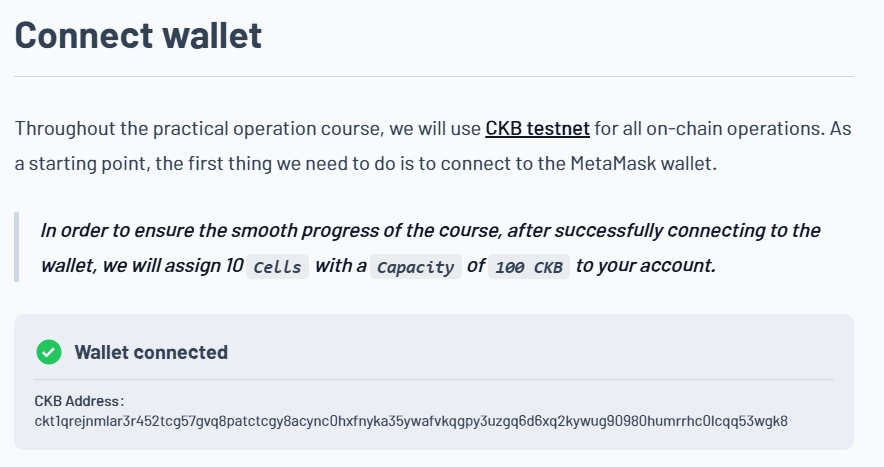
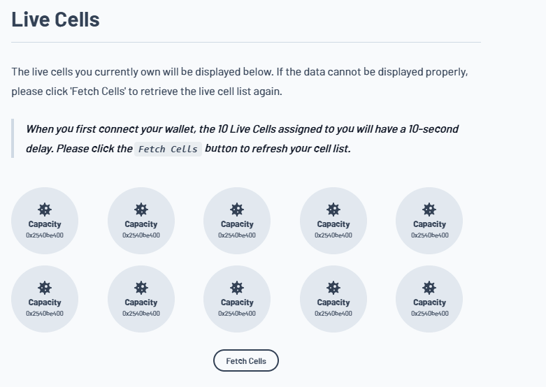
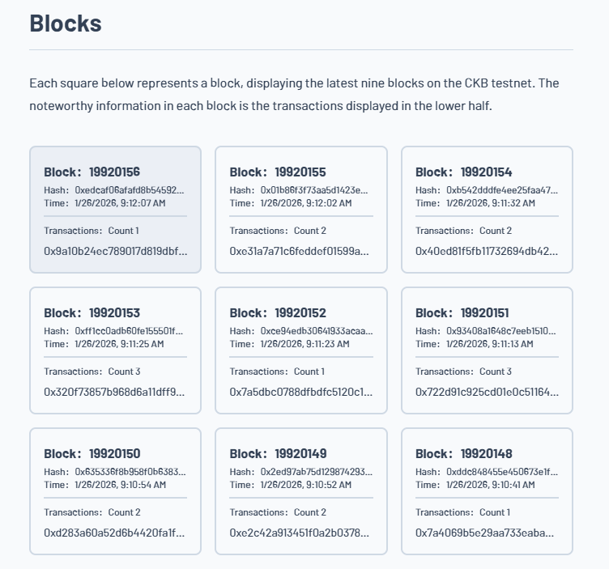
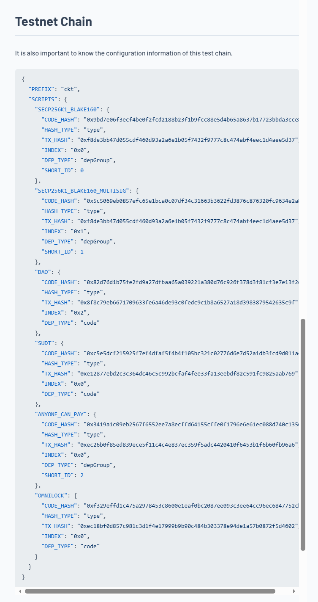
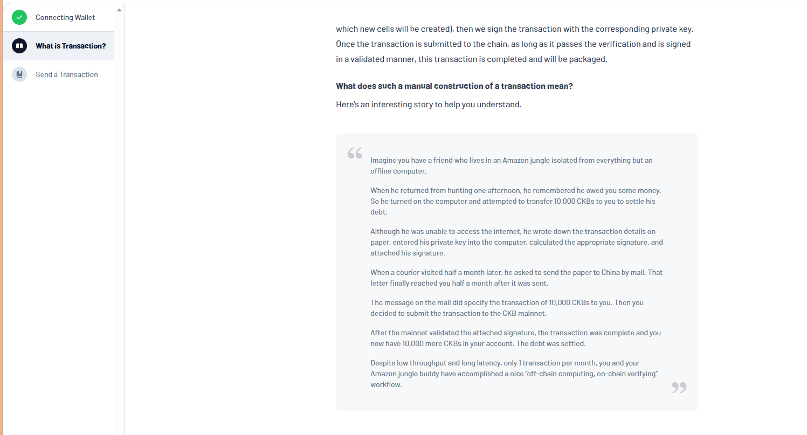
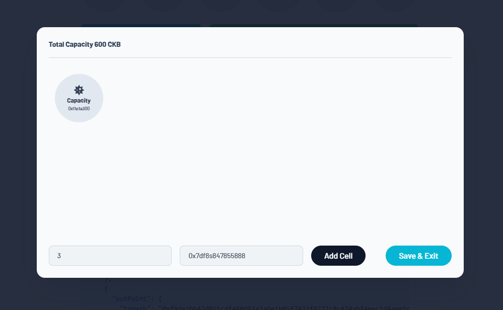
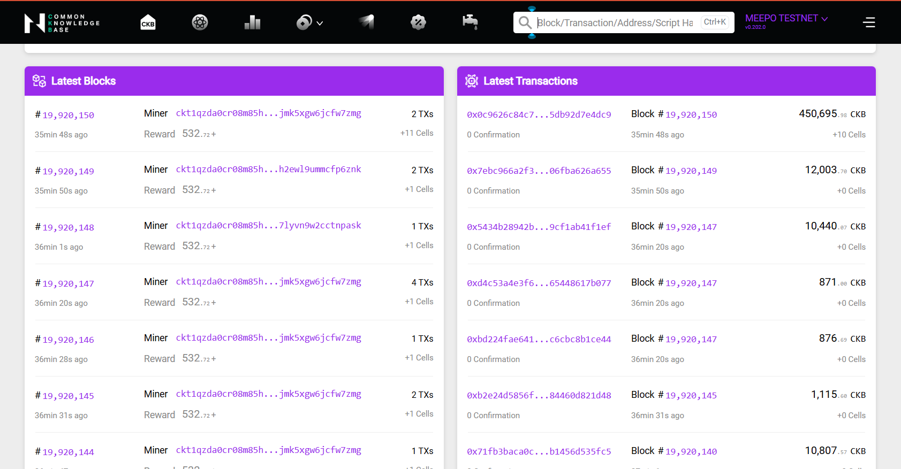
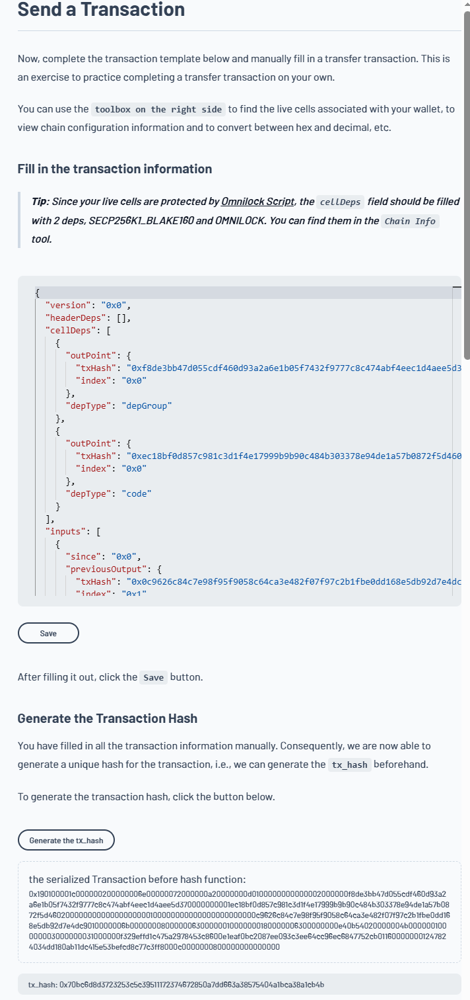

# Builder Track Weekly Report — Week 4

**Name:** Williams Akinwamide.

**Week Ending:** 01-26-2026

## Courses Completed

- Completed the **"Send a Transaction" module** of the CKB Academy practical operations course, which focused on manual transaction construction and signing
- Mastered the complete **transaction lifecycle** including:
  - Understanding CKB's "off-chain computing, on-chain verifying" paradigm
  - Manual construction of transaction inputs, outputs, and dependencies in JSON format
  - Cell selection and capacity management
  - Transaction signing with Phantom wallet integration
  - Broadcasting transactions to the CKB testnet
  - Monitoring transaction status and confirmation on the explorer
- Reviewed supporting materials including **RFC 0042: Omnilock** for understanding lock script authentication mechanisms
- Explored the **CKB Testnet Explorer** at `https://testnet.explorer.nervos.org/` for transaction verification and real-time network observation

## Key Learnings

### CKB Transaction Model

- **Off-Chain/On-Chain Philosophy**: CKB enables constructing and signing transactions offline (like the famous "Amazon jungle friend" analogy), then submitting them for on-chain verification. This design allows flexibility in transaction creation without requiring constant network connectivity.
- **Transaction Anatomy**: A CKB transaction consists of:
  - **Inputs**: References to existing live cells being spent, specified by `tx_hash` and `index` (outpoint)
  - **Outputs**: New cells being created with specified capacity, lock scripts, and type scripts
  - **Cell Deps**: Dependency cells required for script execution (e.g., Omnilock or SECP256K1_BLAKE160)
  - **Witnesses**: Signature and proof data required for validation
  - **Header Deps & Version**: Metadata fields (version currently 0x0, header_deps typically empty)
- **Capacity and Fee Mechanics**: The difference between input and output capacity is the transaction fee that rewards miners. Every transaction must satisfy: `sum(output capacity) < sum(input capacity)`

### Transaction Construction Workflow

- **Step 1 - Define Inputs**: Select live cells from wallet and drag them into the input section to create outpoint references
- **Step 2 - Create Outputs**: Specify new cells to create with desired capacity, lock script, and lock args
- **Step 3 - Generate Transaction Hash**: Before signing, the transaction is serialized and hashed with blake2b to create a unique `tx_hash`. This hash is deterministic and can be generated offline beforehand
- **Step 4 - Sign Transaction**:
  - Generate a message from the serialized transaction
  - Connect wallet (Phantom in this case) to sign the message
  - Receive signature from wallet
  - Serialize signature into `WitnessArgs` molecule format with the signature in the `lock` field
  - Add serialized witness to the transaction
- **Step 5 - Broadcast**: Submit the complete transaction to the testnet node
- **Step 6 - Verify**: Check transaction status on testnet explorer (pending, confirmed, or failed)

### Witness and Signature Structure

- **WitnessArgs Molecule Format**: Each witness follows a structured format with three optional fields:
  - `lock`: Contains signature and proof data required by the lock script (e.g., OmniLockWitnessLock)
  - `input_type`: Type script arguments for inputs (optional)
  - `output_type`: Type script arguments for outputs (optional)
- **Lock Field Data**: For Omnilock-protected cells, the lock field must contain OmniLockWitnessLock structure with signature, omni_identity, and preimage fields
- **Cell Deps Requirement**: When spending cells protected by Omnilock, the cellDeps must include references to both the SECP256K1_BLAKE160 and OMNILOCK script cells

### Practical Insights

- **Deterministic Hash Generation**: The CKB design guarantees that the tx_hash generated before broadcasting matches the hash after on-chain confirmation, providing certainty that the submitted transaction is exactly what was prepared
- **Manual JSON Construction**: Building transactions in raw JSON format provides deep understanding of transaction structure and cell mechanics compared to using high-level abstractions
- **Wallet Integration**: Modern wallets like Phantom provide user-friendly signing without exposing private keys, while maintaining the security properties of manual transaction construction

## Practical Progress

- Successfully completed the **Send a Transaction exercise**:
  - Manually constructed a transfer transaction in JSON format
  - Selected 6 live cells from wallet and configured inputs with proper cell dependencies
  - Created new output cells with specified capacities and lock scripts
  - Generated transaction hash: `0x70bc6d8d3723253c5c39511172374672850a7dd663a38575404a1bca38a1cb4b`
  - Connected and used **Phantom wallet** to sign the transaction with a generated message
  - Received signature: `0xe97d79a9aa92c0a29c552b9b8e36ce8f9b175f1db1a1f7cb611beb764ee654ed5e6d26cb27ecfe96f30a8e46ab25391a467c3b47600c78464db214afedd1697100`
  - Serialized witness args into molecule format
  - Successfully broadcast transaction to CKB testnet
  - Verified transaction status on the testnet explorer
- Gained hands-on experience with the complete transaction lifecycle from conception to on-chain confirmation
- Demonstrated understanding of cell-based model, capacity management, and script dependencies

## Environment

- Continuing work with the `my-ccc-app` project for practical CKB development.
- Phantom wallet successfully integrated and configured for transaction signing on CKB testnet.
- CKB Testnet Explorer as the primary tool for transaction verification and monitoring.
- Access to CKB Academy live environment and transaction construction tools for hands-on learning.
- Familiarity with both manual transaction construction and wallet-assisted signing workflows.

## Images of Progress

_Progress on manual transaction construction and signing:_

