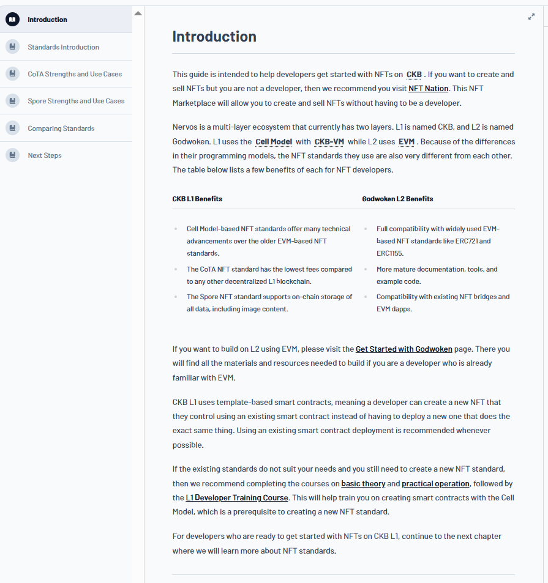
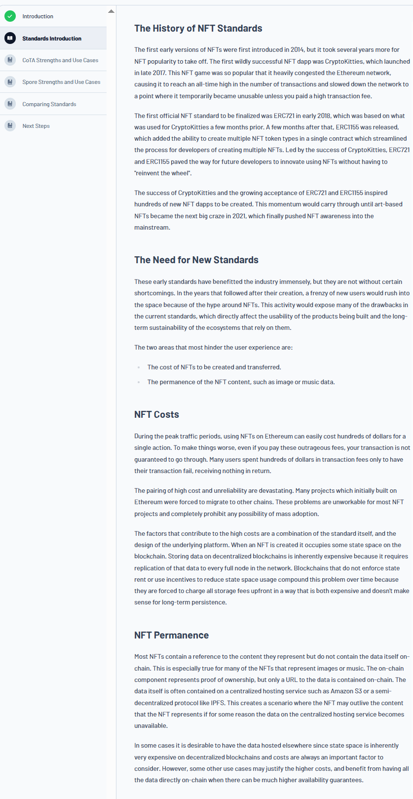
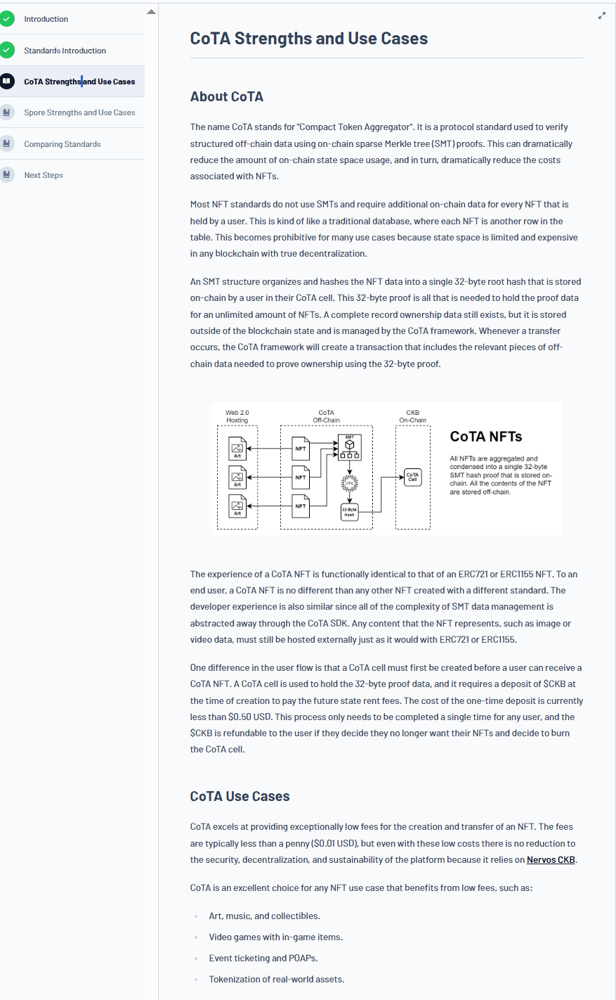
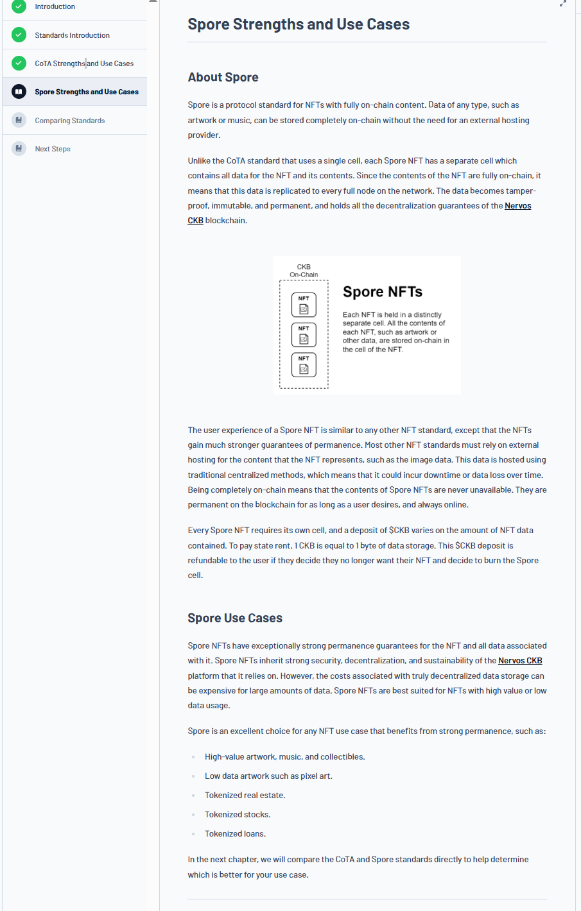
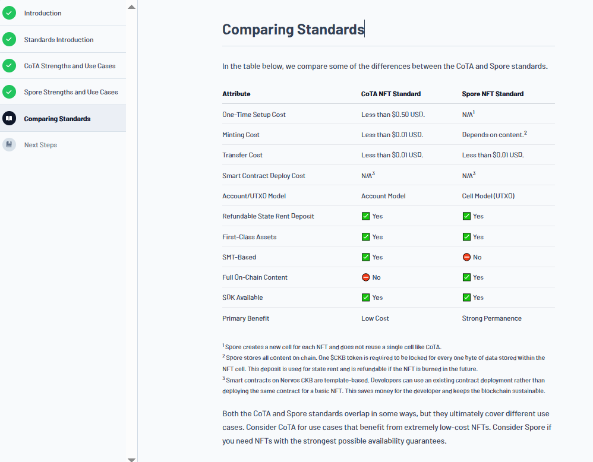

# Builder Track Weekly Report — Week 5

**Name:** Williams Akinwamide.

**Week Ending:** 08-02-2026

## Courses Completed

- Continued the **"NFT Getting Started" module** of the CKB Academy course at `https://academy.ckb.dev/courses/nft-getting-started`
- Deep-dived into **Nervos Network Architecture**, understanding:
  - CKB Layer 1 blockchain fundamentals and design principles
  - Godwoken Layer 2 solution integration at `https://docs.godwoken.io/`
  - Comparative analysis of standards used across different layers
- Studied **NFT Standards Evolution**:
  - Historical context of NFT standards development
  - Why new standards are necessary for improved user experience
  - Two critical areas hindering current user experience
- Comprehensive exploration of **CoTA (Compact Token Aggregator)** and **Spore** standards:
  - Official documentation from CoTA at `https://www.cotadev.io/` and `https://www.cotadev.io/docs/getting-started/overview`
  - CoTA SDK implementation via `https://github.com/nervina-labs/cota-sdk-js`
  - Spore protocol overview at `https://spore.pro/` and `https://github.com/sporeprotocol/spore-sdk`
- Joined the **Nervos community** on Talk.nervos.org (`https://talk.nervos.org/`) for ongoing engagement and support

## Key Learnings

### Nervos Network Architecture

- **Multi-Layer Design**: The Nervos ecosystem comprises CKB Layer 1 and Godwoken Layer 2, each serving distinct purposes with different technical standards
- **Layer 1 (CKB)**: Provides the foundational, decentralized security and settlement layer
- **Layer 2 (Godwoken)**: Enables high-throughput transaction processing and improved user experience through enhanced scalability
- **Standard Divergence**: Different layers employ distinct standards due to their architectural differences and optimization priorities

### NFT Standards: CoTA vs. Spore

#### CoTA (Compact Token Aggregator) Standard

**Purpose & Design Principles:**

- Protocol standard for cost-efficient NFTs using sparse Merkle tree (SMT) proofs to verify off-chain data on-chain
- Dramatically reduces on-chain state space usage, directly lowering NFT costs
- Stores a single 32-byte root hash on-chain while maintaining complete ownership records off-chain
- CoTA framework handles complexity automatically through SDK abstractions

**Technical Mechanism:**

- SMT structures organize and hash NFT data into a single proof
- Transfer transactions include necessary off-chain data pieces for proving ownership via the 32-byte proof
- User-facing experience is identical to ERC721 or ERC1155 standards
- Developer experience simplified through CoTA SDK abstraction of complex SMT data management

**CoTA Cell Requirements:**

- Users must create a CoTA cell before receiving CoTA NFTs (one-time setup)
- Cell holds the 32-byte proof data
- Requires initial $CKB deposit (currently <$0.50 USD) to cover future state rent fees
- Deposit is refundable if user decides to burn the CoTA cell and discontinue NFT holdings

**Cost & Use Cases:**

- Transaction fees typically less than $0.01 USD
- Maintains full security, decentralization, and sustainability guarantees
- Ideal for: Art, music, collectibles, gaming in-game items, event ticketing and POAPs, real-world asset tokenization

#### Spore Standard

**Purpose & Design Principles:**

- Protocol standard for NFTs with fully on-chain content storage
- Any data type (artwork, music, etc.) stored completely on-chain without external hosting
- Content replicated across all network full nodes, ensuring tamper-proof, immutable, permanent data
- Inherits all decentralization guarantees of the Nervos CKB blockchain

**Technical Mechanism:**

- Each Spore NFT has a separate cell containing all NFT data and content
- Fully on-chain storage means content is always available and never subject to downtime
- Data permanence guaranteed as long as cell exists on-chain
- Set-and-forget approach: once deployed, content remains permanently available

**Storage & Economics:**

- Each Spore NFT requires its own cell
- $CKB deposit required (varies based on data size)
- Storage model: 1 CKB = 1 byte of data storage
- Deposit refundable upon burning the Spore cell

**Permanence & Use Cases:**

- Exceptionally strong permanence guarantees (no external hosting dependencies)
- Addresses traditional NFT vulnerability: external data loss or downtime
- Ideal for: High-value artwork/music/collectibles, low-data pixel art, tokenized real estate, tokenized stocks, tokenized loans
- Best suited for NFTs with high value or limited data requirements

### Comparative Analysis

**Cost vs. Permanence Tradeoff:**

- **CoTA**: Optimized for low costs, suitable for high-volume, lower-value NFTs (gaming items, collectibles)
- **Spore**: Optimized for permanence and security, suitable for high-value or critical data NFTs

**Data Hosting:**

- **CoTA**: Off-chain data management with on-chain proof (low cost, requires external infrastructure)
- **Spore**: Complete on-chain storage (higher cost, absolute permanence)

**User Experience:**

- Both standards maintain familiar NFT user experience similar to existing standards
- Functional differences are transparent to end-users
- Developer experience similarly abstracted through respective SDKs

### Problem Areas Addressed

The two critical areas where existing NFT standards hinder user experience:

1. **Cost**: High transaction fees prevent mass adoption and micro-transactions
2. **Permanence**: Reliance on external hosting creates vulnerability to data loss, requiring trusted third parties

CoTA and Spore directly solve these two problems through different approaches, allowing developers to optimize for their specific use cases.

## Practical Progress

- Successfully explored **CoTA ecosystem**:
  - Reviewed CoTA documentation and getting started guides
  - Examined CoTA SDK implementation on GitHub
  - Gained practical understanding of SMT proofs and off-chain data verification
- Successfully explored **Spore ecosystem**:
  - Reviewed Spore protocol documentation and specifications
  - Examined Spore SDK implementation on GitHub
  - Understood fully on-chain content storage architecture

- **Community Integration**:
  - Joined Nervos Talk organization for ongoing community engagement
  - Positioned for real-time support and knowledge sharing with active developers

- Developed comprehensive understanding of how to select appropriate NFT standards based on specific use case requirements

## Environment

- Continuing work with the `my-ccc-app` project for CKB dApp development
- CKB Academy platform as primary learning resource
- Access to official CoTA and Spore documentation and SDKs
- Active engagement with Nervos community through Talk.nervos.org
- Phantom wallet integration maintained from previous week

## Images of Progress

_NFT standards study, architecture exploration, and SDK research:_

