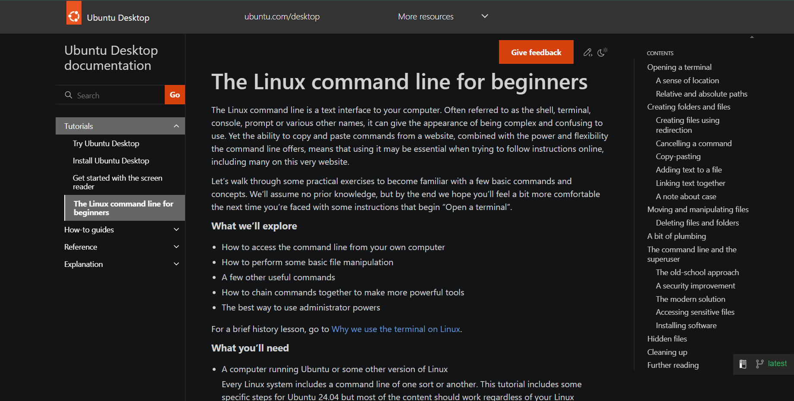
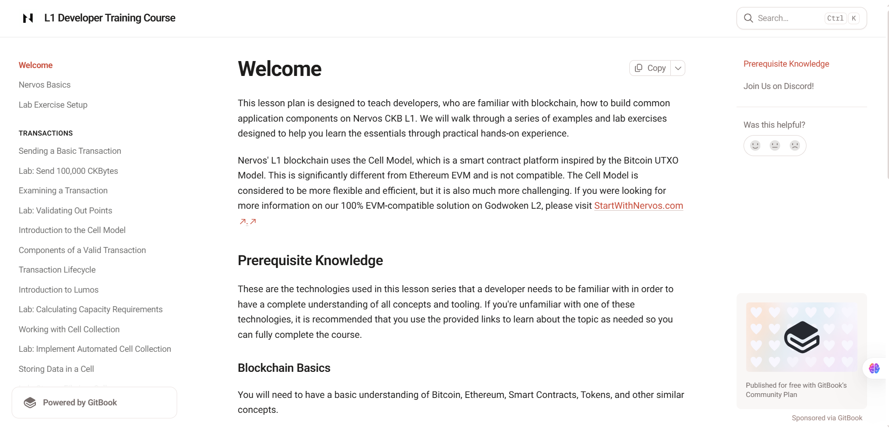
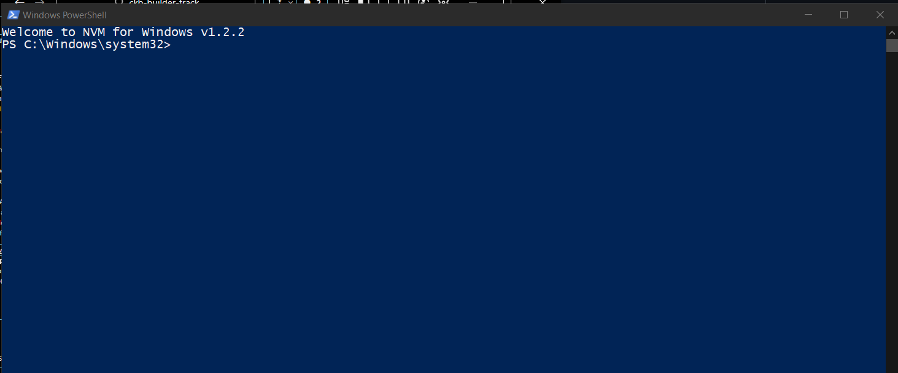
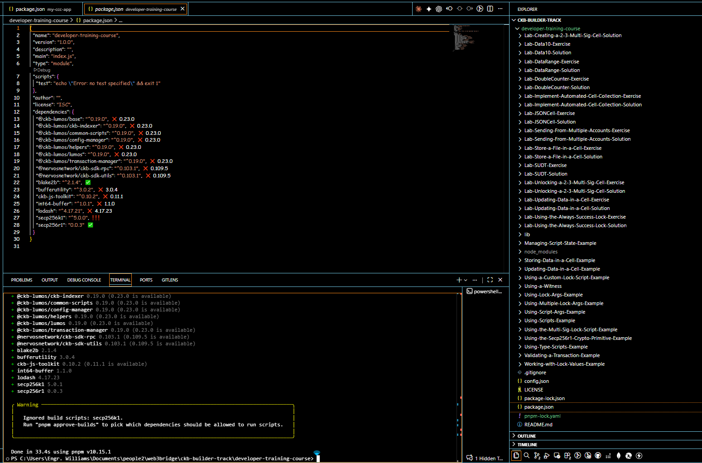

# Builder Track Weekly Report — Week 6

**Name:** Williams Akinwamide.

**Week Ending:** 16-09-2026

## Courses Completed

- Transitioned to **L1 Developer Training Course** at `https://nervos.gitbook.io/developer-training-course/` - a comprehensive hands-on learning path for building on Nervos CKB Layer 1
- Studied **Linux command-line fundamentals** at `https://documentation.ubuntu.com/desktop/en/latest/tutorial/the-linux-command-line-for-beginners/` to establish essential terminal proficiency
- Completed **Nervos Basics** module at `https://nervos.gitbook.io/developer-training-course/nervos-basics` covering foundational Nervos concepts
- Completed **Lab Exercise Setup** at `https://nervos.gitbook.io/developer-training-course/lab-exercise-setup` - environment initialization and configuration
- Installed **NVM (Node Version Manager) for Windows** from `https://github.com/coreybutler/nvm-windows/releases` to manage Node.js versions
- Successfully cloned **Developer Training Course Materials** via `git clone https://github.com/jordanmack/developer-training-course.git`
- Completed all dependency installations and local environment setup

## Key Learnings

### Linux Command-Line Essentials

**Core Concepts:**

- **Terminal/Shell Fundamentals**: Understanding the command prompt as the computer's way to solicit commands, with the shell interpreting inputs and producing outputs
- **Working Directory Awareness**: The `pwd` (print working directory) command
- **Navigation**:
  - Relative paths (e.g., `cd dir1/dir2`) depend on current location
  - Absolute paths (e.g., `cd /home/user/Desktop`) begin with `/` and work from the root directory regardless of current position
  - Special shortcuts: `~` (home directory), `..` (parent directory), `.` (current directory)

**File & Directory Operations:**

- `mkdir` for creating directories (with `-p` flag for nested directory creation)
- `ls` for listing files (with `-a` flag to show hidden files starting with `.`)
- `cp` for copying files/directories
- `mv` for moving or renaming files
- `rm` for permanent file deletion (with `-r` flag for recursive directory deletion) - **no recovery possible**
- Interactive deletion with `rm -i` to confirm before each deletion

**File Creation & Manipulation:**

- Output redirection using `>` (overwrites) or `>>` (appends)
- `echo` command for printing text or creating simple files
- `cat` for concatenating and viewing file contents
- `less` pager for viewing large files page-by-page
- Wildcard patterns: `*` (zero or more characters) and `?` (single character) for bulk operations

**Advanced Concepts:**

- **Piping**: Connecting command outputs to inputs using `|` character
  - Example: `ls ~ | wc -l` counts home directory contents
  - Chains multiple commands without temporary files
- **Command Combinations**: Sequencing commands like `sort combined.txt | uniq | wc -l` for complex operations
- **Man Pages**: Using `man command` to access detailed command documentation
- **Hidden Files**: Files prefixed with `.` are hidden by default; accessible with `ls -a`
- **Superuser Privileges**:
  - `sudo` runs individual commands with administrator rights (modern secure approach)
  - Requires user password, cached for 15 minutes
  - Safer than using persistent `su` or direct `root` login
  - `sudo apt install` for package installation from repositories

**Case Sensitivity:**

- Unix systems are case-sensitive: `File.txt`, `file.txt`, and `FILE.TXT` are three different files
- Best practice: Use all lowercase, numbers, underscores, and hyphens for filenames to avoid confusion

### Nervos L1 Developer Training Course Overview

**Course Purpose & Structure:**

- Comprehensive training for developers building on **Nervos CKB Layer 1** using the **Cell Model**
- Cell Model is inspired by Bitcoin's UTXO model, more flexible than Ethereum EVM but more complex
- Designed for sequential completion - each exercise builds on previous lessons
- Community support available on Discord in the `#developer-training-course` channel

### Nervos Basics Foundation

**Core Concepts Covered:**

- **Nervos Blockchain**: The CKB Layer 1 foundation providing security and settlement
- **Cell Model**: The fundamental data structure enabling stateful smart contracts
  - Inspired by Bitcoin's UTXO model
  - More flexible for diverse applications than EVM accounts
  - Requires different thinking about state management
- **Consensus Mechanism**: How transactions are validated and blocks are formed
- **Economics**: Incentive structures and token mechanics (CKB token)
- **CKB-VM**: The virtual machine executing on-chain code
  - RISC-V based architecture
  - Different from Ethereum's EVM

**Local Environment Setup Process:**

1. Install Node.js v18 LTS (via NVM or direct installation)
2. Install Git version control
3. Clone developer training materials: `git clone https://github.com/jordanmack/developer-training-course.git`
4. Navigate to directory: `cd developer-training-course`
5. Install Node dependencies: `pnpm i`

## Practical Progress

- **Successfully installed NVM Windows** from official GitHub releases
  - Enables flexible Node.js version management
  - Critical infrastructure for managing multiple CKB development environments

- **Cloned developer training repository** containing all example code and lab materials
  - Comprehensive resource with sequential lessons
  - Includes transaction examples and Lumos framework integration

- **Completed dependency installation** via `pnpm i`
  - All Node.js packages installed successfully
  - Environment ready for development exercises

## Comparison: Cell Model vs. EVM Model

**Nervos CKB (Cell Model):**

- UTXO-inspired model similar to Bitcoin
- Cells are stateful objects with full programmability
- Off-chain computation, on-chain verification paradigm
- More flexible for diverse use cases
- Steeper learning curve but more powerful

**Ethereum (EVM Model):**

- Account-based model with global state
- Smart contracts deploy to addresses
- Easier conceptual model for traditional developers
- More established ecosystem
- Different approach to state management

## Environment

- **Development Platform**: Windows with NVM for Node.js management
- **Local CKB Setup**: Ready for devnet configuration
- **Development Tools**:
  - Node.js v18 LTS
  - Git version control
  - Linux command-line knowledge (terminal proficiency)
- **Learning Resources**: CKB Academy, official Nervos documentation, developer training course
- **Community**: Nervos Talk and Discord server engagement for Q&A and collaboration

## Images of Progress

_Linux command-line study, developer training course introduction, lab environment setup, and NVM installation:_

