# Builder Track Weekly Report — Week 7

**Name:** Williams Akinwamide.

**Week Ending:** 25-02-2026

## Courses Completed

- Continued the **L1 Developer Training Course** Transactions module at `https://nervos.gitbook.io/developer-training-course/transactions`
- Completed **Sending a Basic Transaction** at `https://nervos.gitbook.io/developer-training-course/transactions/sending-a-transaction`
- Completed **Lab: Send 100,000 CKBytes** at `https://nervos.gitbook.io/developer-training-course/transactions/lab-send-100-000-ckbytes`
- Completed **Examining a Transaction** at `https://nervos.gitbook.io/developer-training-course/transactions/examining-a-transaction`
- Completed **Sending a Transaction with Multiple Inputs and Outputs** (now presented as Cell Model introduction content in this section) at `https://nervos.gitbook.io/developer-training-course/transactions/sending-a-transaction-with-multiple-inputs-and-outputs`
- Completed **Components of a Transaction** at `https://nervos.gitbook.io/developer-training-course/transactions/components-of-a-transaction`
- Completed **Transaction Lifecycle** at `https://nervos.gitbook.io/developer-training-course/transactions/transaction-lifecycle`
- Completed **Introduction to Lumos** at `https://nervos.gitbook.io/developer-training-course/transactions/introduction-to-lumos`
- Completed **Lab: Calculating Capacity Requirements** at `https://nervos.gitbook.io/developer-training-course/transactions/lab-calculating-capacity-requirements-exercise`

## Key Learnings

### Tutorial Completed: "Sending a Basic Transaction"

**Source:** `https://nervos.gitbook.io/developer-training-course/transactions/sending-a-transaction`

### What I did:

- Completed the "Sending a Basic Transaction" lesson from the Nervos L1 Developer Training Course (Transactions section)
- Used the `ckb-cli` command-line workflow to interact with a local CKB Dev Blockchain (devnet)
- Verified pre-funded genesis accounts using `account list`
- Executed CKBytes transfers using `wallet transfer`
- Confirmed submitted transactions by capturing the returned transaction hash (transaction ID)

### Key Concepts Learned:

**CKB Addresses:**

- CKB addresses encode identity and unlocking information, plus checksum protection
- Mainnet and testnet address formats are intentionally incompatible, reducing cross-network mistakes
- Devnet uses testnet-format addresses (`ckt1...`)
- Address abbreviation (for example, `ckt1...gwga`) improves readability during CLI workflows

**CKB Dev Blockchain (Devnet):**

- Local devnet is required for the transaction labs in this module
- Genesis accounts are pre-funded for hands-on practice and exist only in dev blockchain setups
- Devnet workflow allows repeated local transaction testing with fast feedback

**Sending Transactions with ckb-cli:**

- `wallet transfer` is used to send CKBytes between addresses
- Core parameters:
  - `--from-account` for sender
  - `--to-address` for receiver
  - `--capacity` for transfer amount
- A submitted transaction returns a tx hash that uniquely identifies the transaction

**ckb-cli Tool Usage:**

- `account new` to create a new address
- `account list` to inspect managed accounts
- `wallet transfer` to submit CKBytes transfers
- `rpc get_transaction --hash <TX_HASH>` to inspect commitment status and transaction details

### Additional Transactions Module Learnings

**Lab: Send 100,000 CKBytes:**

- Practiced creating a new account and transferring `100,000` CKBytes from `ckt1...gwga` to a newly created address
- Reinforced transaction tracking by saving tx hash output for later analysis exercises

**Examining a Transaction:**

- Learned how to inspect transaction structure and status with RPC (`pending`, `proposed`, `committed`)
- Reviewed inputs, outputs, witnesses, and dependencies from returned JSON

**Sending with Multiple Inputs and Outputs / Cell Model Context:**

- Understood that CKB uses the Cell Model where transactions consume existing live cells and create new cells
- Learned that multi-input/multi-output transactions are natural in CKB when balancing capacity and change

**Components of a Transaction:**

- Studied key transaction fields: `version`, `cell_deps`, `header_deps`, `inputs`, `outputs`, `outputs_data`, `witnesses`
- Learned core validation conditions:
  - At least one input
  - All inputs authorized by lock scripts
  - Referenced scripts execute successfully
  - Output capacity does not exceed input capacity
  - Transaction fee is sufficient

**Transaction Lifecycle:**

- End-to-end flow learned:
  1. Create transaction
  2. Add input cells
  3. Add output cells
  4. Add change cell
  5. Add dependencies
  6. Add signatures/witnesses
  7. Broadcast to node
  8. Wait for confirmation

**Introduction to Lumos (index.js walkthrough):**

- Reviewed the full `index.js` walkthrough in `Introduction-to-Lumos-Example`
- Understood how Lumos transaction skeletons are built and updated using Immutable-style `update()` calls
- Traced each major step in code: config init, cell deps, live-cell input, output construction, witness placeholder insertion, signing, broadcast, confirmation polling
- Confirmed practical implication of outpoints: once a live cell is spent, the same outpoint becomes unusable (dead/unknown) and the script fails if reused

**Lab: Calculating Capacity Requirements:**

- Completed the required one-input/two-output transaction design
- Applied exact TX fee of `0.0001 CKByte` (`10,000` Shannons)
- Built output1 with `1,000 CKBytes` and output2 as proper change cell
- Validated transaction against lab checks and successfully sent the transaction

## Practical Progress

- Updated `Introduction-to-Lumos-Example/index.js`:
  - Configured local devnet RPC/indexer at `127.0.0.1:28114`
  - Set devnet account/private key constants
  - Tested with outpoint `0x1bb87da347a776a927ab6593e1e10304ca195f8e24279f039008d5e3115b1bf7-0x16` and observed expected live-cell reuse failure behavior

- Added `Introduction-to-Lumos-Example/find_outpoint.js`:
  - Script to scan genesis block outputs and compare lock script ownership
  - Added direct live-cell status check via RPC to validate whether candidate outpoints are still spendable

- Completed and improved `Lab-Calculating-Capacity-Requirements-Exercise/index.js`:
  - Implemented robust config loading using `import.meta.url`
  - Implemented `getInputCell()` to dynamically find a usable live cell with enough capacity instead of hardcoding a single outpoint
  - Constructed valid output2 change cell and validated fee/output constraints
  - Successfully executed and confirmed transaction:
    - `0xa99a4f8aab91bd4fb817484dc6374bf4d3727e3f1df19d41a2b4a4194a4db803`

- Performed local devnet debugging and stabilization:
  - Resolved `EADDRINUSE`/database lock behavior caused by duplicate `offckb`/`ckb` processes
  - Validated RPC functionality using JSON-RPC POST calls (`get_tip_block_number`)
  - Confirmed that browser GET requests to RPC endpoint are expected to return method-not-allowed responses

## Environment

- **Network:** Local CKB devnet via `offckb node`, RPC proxy at `http://127.0.0.1:28114`
- **Node Runtime:** Switched and validated Node.js `v20.18.3` with `nvm-windows`
- **Training Repo:** Active work in `developer-training-course` with modified transaction examples and lab exercise files
- **Workflow:** Combined CLI operations (`account`, `wallet transfer`, `rpc`) with Lumos code-level transaction building and validation

## Images of Progress

_Week 7 progress across environment setup, offckb transaction flow, and Lumos/code labs:_

**Node/offckb setup and environment debugging**

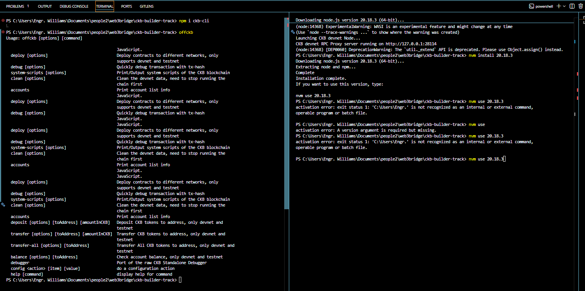
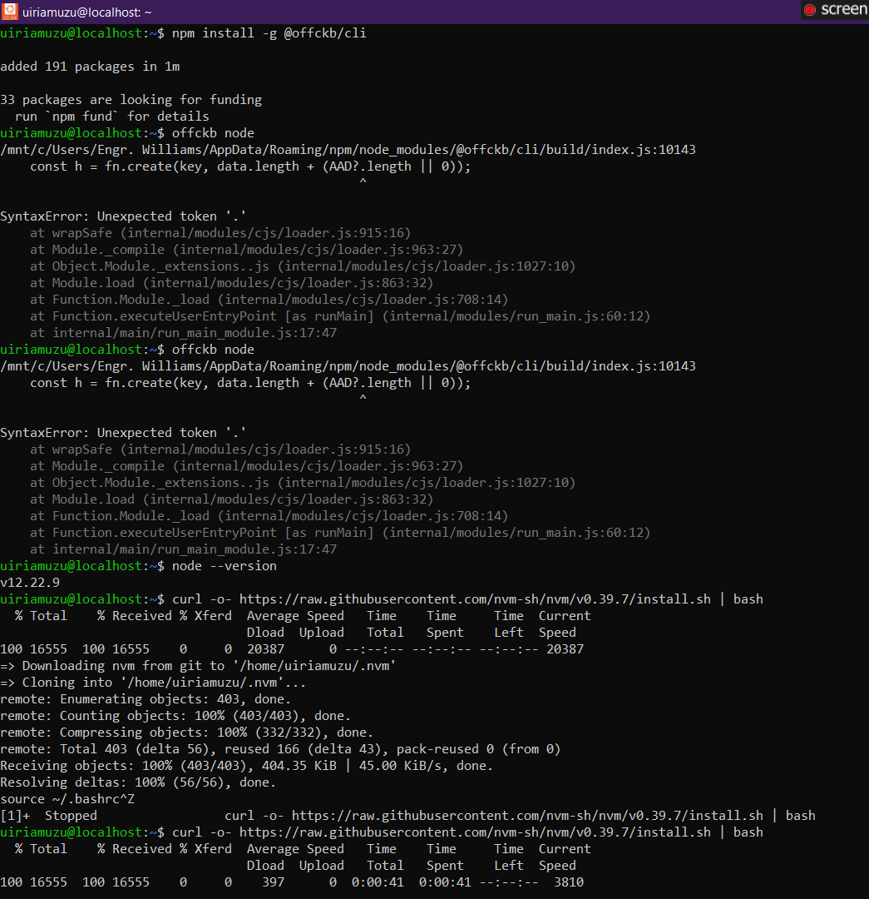
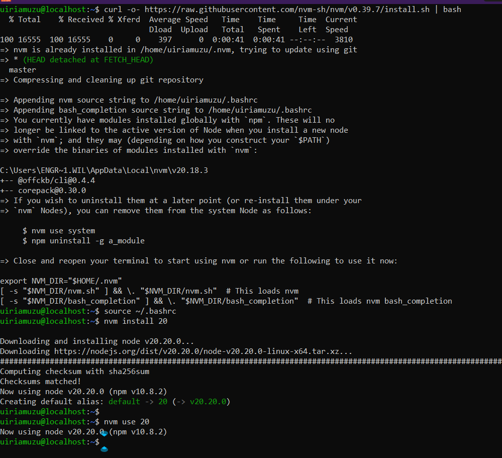
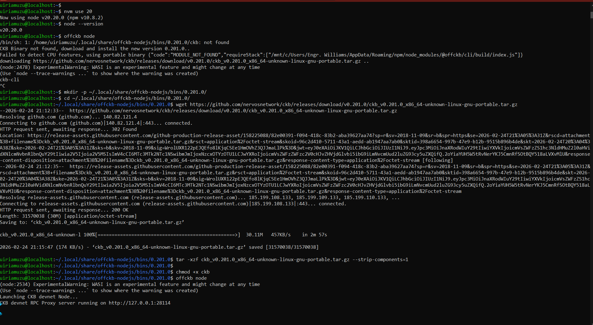

**offckb commands, accounts, and transfer operations**

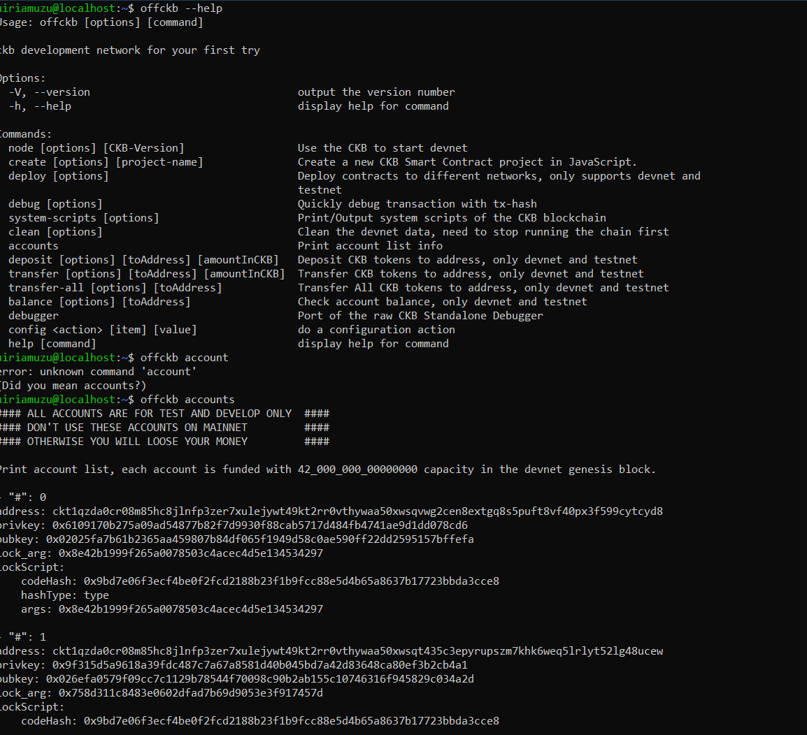
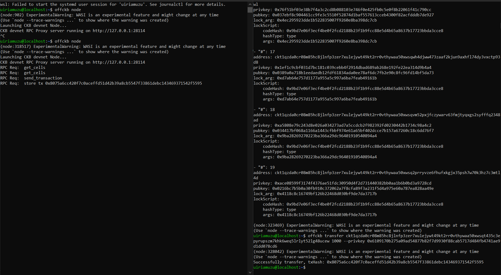

**Project scaffolding and dependency installation logs**

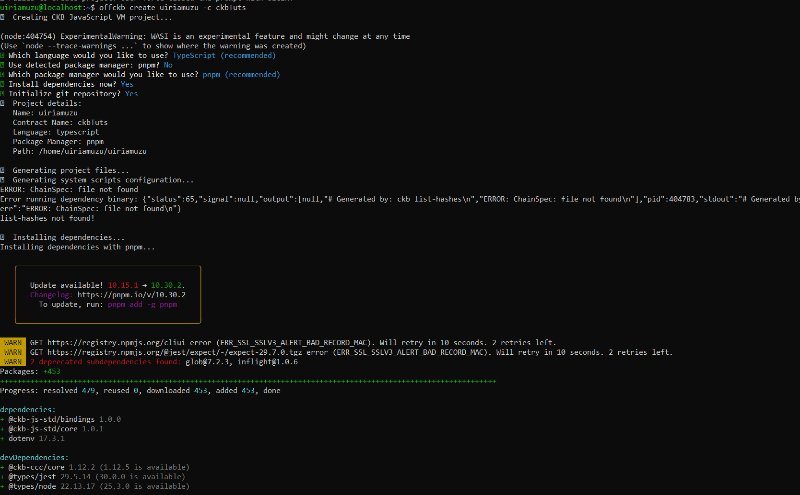
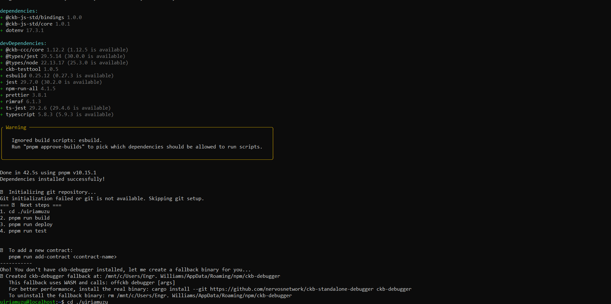

**Lumos walkthrough, outpoint discovery, and lab code execution**

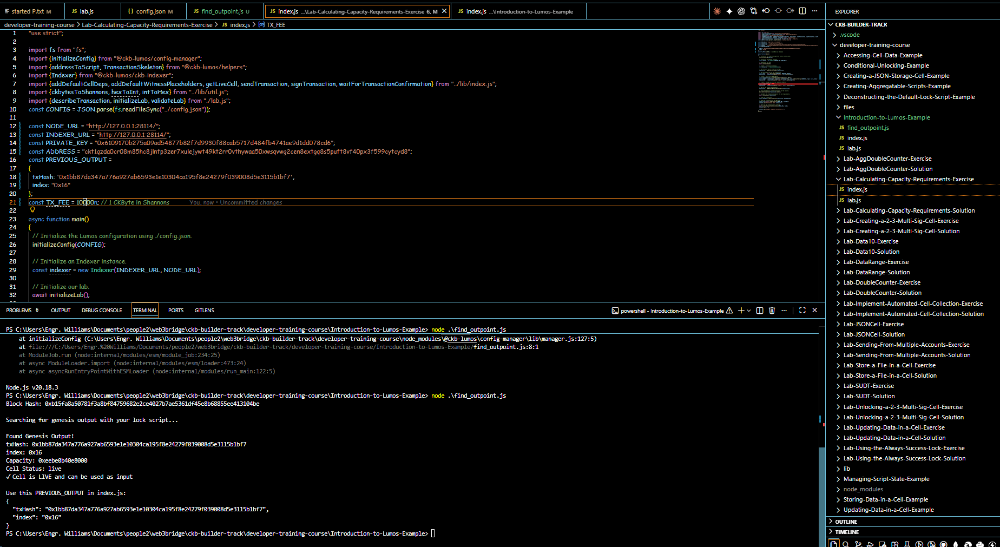
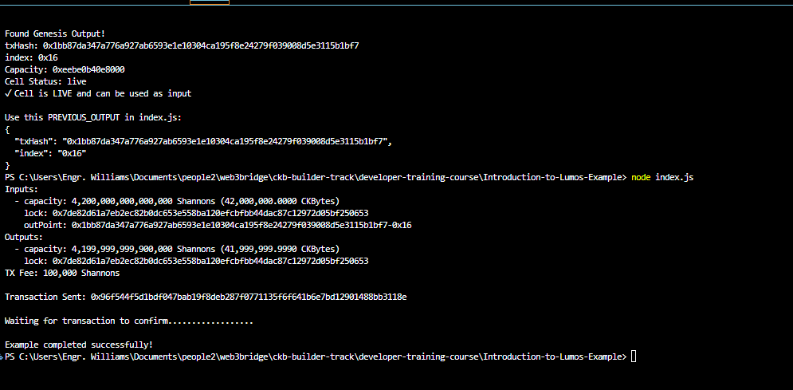
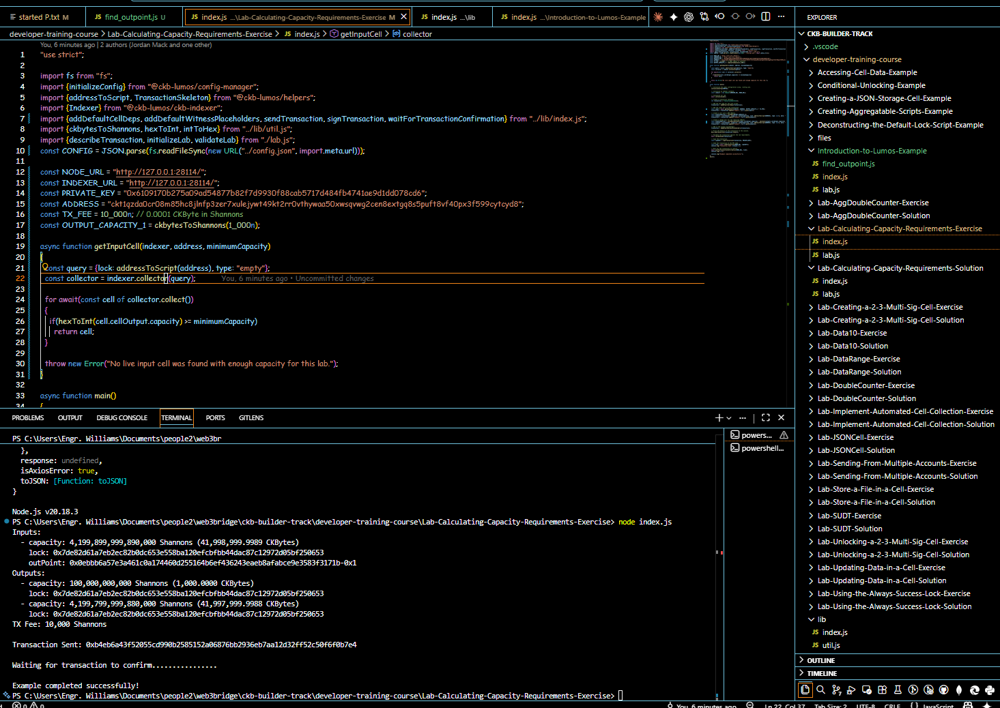
