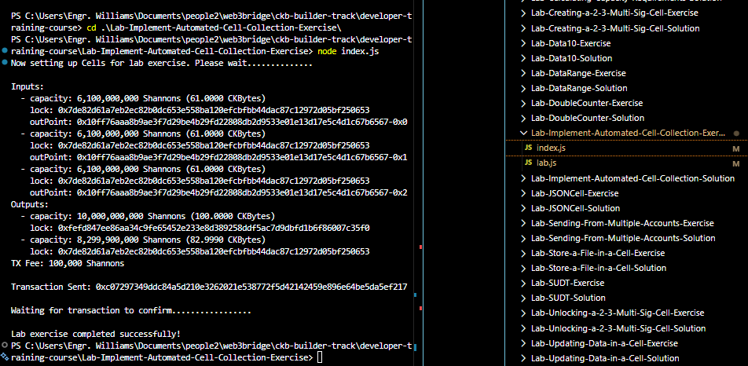
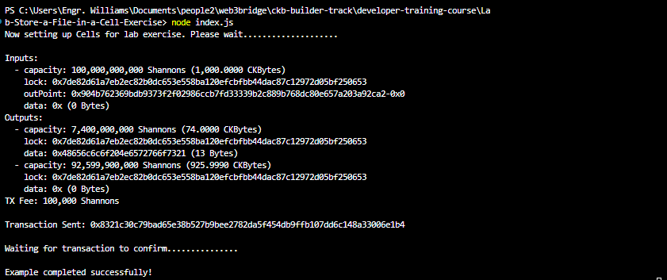
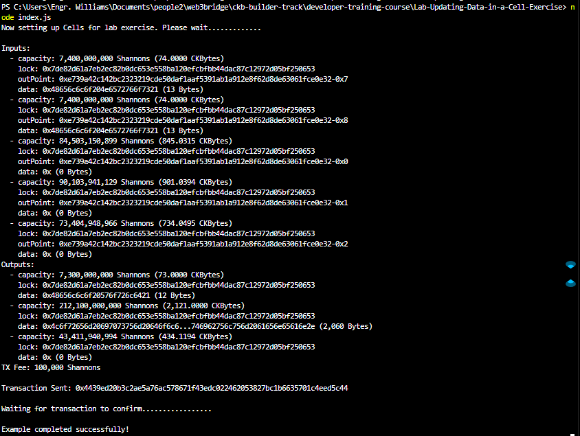

# Builder Track Weekly Report — Week 8

**Name:** Williams Akinwamide.

**Week Ending:** 02-03-2026

## Courses Completed on Lumos (Updating report for CCC)

- Continued the **L1 Developer Training Course** Data Management module at `https://nervos.gitbook.io/developer-training-course/data-management`
- Completed **Working with Cell Collection** at `https://nervos.gitbook.io/developer-training-course/transactions/working-with-cell-collection`
- Completed **Lab: Implement Automated Cell Collection** at `https://nervos.gitbook.io/developer-training-course/transactions/lab-implement-automated-cell-collection`
- Completed **Storing Data in a Cell** at `https://nervos.gitbook.io/developer-training-course/data-management/storing-data-in-a-cell`
- Completed **Lab: Store a File in a Cell** at `https://nervos.gitbook.io/developer-training-course/data-management/lab-store-a-file-in-a-cell`
- Completed **Updating Data in a Cell** at `https://nervos.gitbook.io/developer-training-course/data-management/updating-data-in-a-cell`
- Completed **Lab: Updating Data in a Cell** at `https://nervos.gitbook.io/developer-training-course/data-management/lab-updating-data-in-a-cell`

## Key Learnings

### Tutorial: "Working with Cell Collection"

**Source:** `https://nervos.gitbook.io/developer-training-course/transactions/working-with-cell-collection`

#### What I did:

- Studied how CKB's Cell Model handles input gathering through automated cell collection
- Learned how the Lumos `CellCollector` and `collectCapacity()` utility streamline the process of finding live cells to fund transactions
- Understood the relationship between cell collection, capacity requirements, and change cell creation

#### Key Concepts Learned:

**Automated Cell Collection:**

- Manual outpoint specification is impractical for real applications; cell collection automates finding live cells with sufficient capacity
- `collectCapacity(indexer, lockScript, capacityRequired)` from the shared library handles the collection logic
- The function queries the indexer for live cells matching a lock script and accumulates them until the required capacity is met

**Capacity Calculation Pattern:**

- Total capacity required = output capacity + minimum change cell capacity (61 CKBytes) + TX fee
- The 61 CKByte minimum ensures any change cell created meets the minimum cell size requirement
- If collected capacity exactly matches output + fee (no leftover), no change cell is needed — but this is rare in practice

**Change Cell Management:**

- After collecting inputs, the difference between input capacity and (output capacity + TX fee) becomes the change cell
- Change cell capacity = `inputCapacity - outputCapacity - TX_FEE`
- The change cell is locked back to the sender's address with empty data (`0x`)

---

### Lab: "Implement Automated Cell Collection"

#### What I did:

- Completed the lab exercise in `Lab-Implement-Automated-Cell-Collection-Exercise/index.js`
- Constructed a transaction that sends 100 CKBytes to a recipient address using automated cell collection
- Implemented capacity calculation, input collection, and change cell creation

#### Code Implementation:

1. **TX_FEE:** Set to `100_000n` Shannons (0.001 CKBytes) — standard transaction fee
2. **Output capacity:** `intToHex(ckbytesToShannons(100n))` — 100 CKBytes for the recipient
3. **Capacity required:** `ckbytesToShannons(100n) + ckbytesToShannons(61n) + TX_FEE` — output + minimum change cell + fee
4. **Input collection:** `await collectCapacity(indexer, addressToScript(ADDRESS_1), capacityRequired)` — automated gathering of live cells
5. **Change cell capacity:** `intToHex(inputCapacity - outputCapacity - TX_FEE)` — remaining CKBytes returned to sender
6. **Change cell output:** `{cellOutput: {capacity: outputCapacity2, lock: addressToScript(ADDRESS_1), type: null}, data: "0x"}` — empty data cell locked to sender

#### Transaction Structure:

- **Inputs:** One or more cells from `ADDRESS_1` collected automatically
- **Output 1:** 100 CKBytes to `ADDRESS_2` (recipient)
- **Output 2:** Change cell returning remaining CKBytes to `ADDRESS_1` (sender)
- **Fee:** 100,000 Shannons deducted from input capacity

---

### Tutorial: "Storing Data in a Cell"

**Source:** `https://nervos.gitbook.io/developer-training-course/data-management/storing-data-in-a-cell`

#### What I did:

- Studied how arbitrary data (files, strings) can be stored on-chain in CKB cells
- Learned the capacity formula for data-bearing cells: base 61 CKBytes + 1 CKByte per byte of data
- Understood how data is encoded as hex strings and attached to cell outputs

#### Key Concepts Learned:

**Data Storage in Cells:**

- Every CKB cell can hold arbitrary data in its `data` field
- Data is stored as a hex-encoded string (e.g., "Hello Nervos!" becomes `0x48656c6c6f204e6572766f7321`)
- The `readFileToHexString()` utility reads a file and converts its contents to a hex string suitable for on-chain storage

**Capacity Requirements for Data Cells:**

- Minimum cell capacity is 61 CKBytes (for the cell structure overhead: capacity field + lock script)
- Each byte of stored data requires 1 additional CKByte of capacity
- Formula: `totalCapacity = 61 CKBytes + dataSize CKBytes`
- Example: Storing "Hello Nervos!" (13 bytes) requires 61 + 13 = 74 CKBytes

**Hex String to Data Size Conversion:**

- Hex string format: `0x` prefix followed by hex-encoded bytes (2 hex chars per byte)
- Data size in bytes: `(hexString.length - 2) / 2`
- The `-2` removes the `0x` prefix before calculating byte count

---

### Lab: "Store a File in a Cell"

#### What I did:

- Completed the lab exercise in `Lab-Store-a-File-in-a-Cell-Exercise/index.js`
- Stored the contents of `HelloNervos.txt` ("Hello Nervos!" = 13 bytes) in an on-chain cell
- Calculated exact capacity requirements and constructed the transaction with proper data encoding

#### Code Implementation:

1. **TX_FEE:** `100_000n` Shannons
2. **Hex encoding:** `"0x" + (await readFile(DATA_FILE)).toString("hex")` — read file buffer and convert to hex string
3. **Data size:** `(hexString.length - 2) / 2` — calculate byte count from hex string
4. **Output capacity:** `intToHex(ckbytesToShannons(61n) + ckbytesToShannons(BigInt(dataSize)))` — 61 CKBytes base + 1 CKByte per data byte
5. **Output cell:** `{cellOutput: {capacity: outputCapacity1, lock: addressToScript(ADDRESS), type: null}, data: hexString}` — cell with file data

#### Transaction Structure:

- **Inputs:** Collected automatically to cover output + change + fee
- **Output 1:** 74 CKBytes (61 + 13) containing `0x48656c6c6f204e6572766f7321` ("Hello Nervos!")
- **Output 2:** Change cell with remaining CKBytes
- **Fee:** 100,000 Shannons

---

### Tutorial: "Updating Data in a Cell"

**Source:** `https://nervos.gitbook.io/developer-training-course/data-management/updating-data-in-a-cell`

#### What I did:

- Studied how cell data is "updated" on CKB despite cells being immutable structures
- Learned the consume-and-recreate pattern: destroy the old cell (input) and create a new one (output) with different data
- Understood how `CellCollector` queries can be filtered by data content to locate specific cells

#### Key Concepts Learned:

**Cell Immutability and the Update Pattern:**

- Cells on CKB are immutable — once committed to the blockchain, they cannot be modified
- "Updating" a cell means consuming the existing cell as a transaction input and creating a new cell as an output with different data
- The consumed cell and the created cell have no direct on-chain link; conceptually they represent an update, but structurally they are independent
- This distinction becomes critical when working with smart contracts (type scripts) in later lessons

**Querying Cells by Data Content:**

- `CellCollector` queries can include a `data` field to filter cells by their stored data
- Basic query (capacity only): `{lock: lockScript, type: null}`
- Data-filtered query: `{lock: lockScript, type: null, data: hexString}`
- This enables locating specific cells containing known data for targeted updates

**Capacity Recycling:**

- When updating data, the capacity from the consumed input cell is recycled into the new output cell
- If the new data is smaller than or equal to the original, no additional capacity is needed
- If the new data is larger, additional input cells must be collected to cover the increased capacity requirement

---

### Lab: "Updating Data in a Cell"

#### What I did:

- Completed the lab exercise in `Lab-Updating-Data-in-a-Cell-Exercise/index.js`
- Located two existing cells containing "Hello Nervos!" data and replaced their data with "Hello World!" and Lorem Ipsum content
- Implemented conditional capacity collection and change cell creation for cases where output capacity exceeds input capacity

#### Transaction Structure:

- **Input 1:** Cell containing "Hello Nervos!" data (consumed/destroyed)
- **Input 2:** Cell containing "Hello Nervos!" data (consumed/destroyed)
- **Input 3+:** Additional capacity cells if needed
- **Output 1:** Cell with "Hello World!" data (61 CKBytes + data size)
- **Output 2:** Cell with Lorem Ipsum data (61 CKBytes + data size)
- **Output 3:** Change cell (if excess capacity exists)
- **Fee:** 100,000 Shannons

## Practical Progress

- Completed three lab exercises with full code implementation:
  - `Lab-Implement-Automated-Cell-Collection-Exercise/index.js` — automated cell gathering and change management
  - `Lab-Store-a-File-in-a-Cell-Exercise/index.js` — file-to-cell data encoding and capacity calculation
  - `Lab-Updating-Data-in-a-Cell-Exercise/index.js` — data-filtered cell queries, consume-and-recreate pattern, conditional capacity handling

- Adapted all exercise files for offckb devnet environment:
  - Updated RPC/indexer URLs to `http://127.0.0.1:28114/`
  - Configured offckb account #0 as the working/lab account across all exercises
  - Configured offckb account #1 as the funder account in all `lab.js` setup files
  - Updated `config.json` MULTISIG script to match offckb system scripts (CODE_HASH and HASH_TYPE)

- Key patterns established for lab workflow:
  - Account #0 (sender/lab account): `ckt1qzda0cr08m85hc8jlnfp3zer7xulejywt49kt2rr0vthywaa50xwsqvwg2cen8extgq8s5puft8vf40px3f599cytcyd8`
  - Account #1 (funder/recipient): `ckt1qzda0cr08m85hc8jlnfp3zer7xulejywt49kt2rr0vthywaa50xwsqt435c3epyrupszm7khk6weq5lrlyt52lg48ucew`
  - All labs use the `initializeLab()` → `validateLab()` → `signTransaction()` → `sendTransaction()` → `waitForTransactionConfirmation()` pipeline

## Environment

- **Network:** Local CKB devnet via `offckb node`, RPC proxy at `http://127.0.0.1:28114`
- **Node Runtime:** Node.js `v20.18.3` with `nvm-windows`
- **Training Repo:** Active work in `developer-training-course` with completed lab exercises
- **Workflow:** Lumos-based transaction construction with automated cell collection, data encoding, and conditional capacity management

## Images of Progress

_Week 8 progress across cell collection, data storage, and data update labs:_

**Lab transaction completions**

